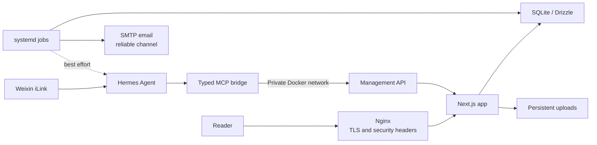

<div align="center">
  <h1>NewBlog / 读写札记</h1>
  <p><strong>A calm, self-hosted personal publishing system for writing, reading, and keeping private thoughts.</strong></p>
  <p>
    <a href="https://blog.kongyu204.com">Live instance</a> ·
    <a href="DEPLOYMENT.md">Deployment guide</a> ·
    <a href="docs/management-api.md">Management API</a> ·
    <a href="README.md">中文说明</a>
  </p>
</div>

NewBlog combines a public blog with a private personal archive. Articles and comments stay
focused on reading; Daily, Bookshelf, and Games become authenticated personal surfaces; the
admin-only Private Notes workspace keeps goals and thoughts out of public discovery. Hermes
Agent can operate the system from Weixin through a typed MCP bridge, without receiving host
Shell, Docker socket, or raw database access.

## Highlights

- Editorial-first Next.js interface with Markdown, cover media, taxonomy, RSS, and reading-friendly article pages.
- Passwordless email authentication with reader/admin roles and a one-time `INITIAL_ADMIN_EMAIL` bootstrap path.
- WeRead bookshelf synchronization with progress, reading time, highlights, reviews, pagination, and privacy filtering.
- Steam archive synchronization with playtime, recent activity, artwork, personal ratings, and curated states.
- Admin-only Private Notes for thoughts, goals, plans, tags, progress, due dates, and archiving.
- Hermes MCP tools for posts, Daily, media, comments, users, books, backups, audit logs, and private notes.
- SMTP-first proactive reports with bounded best-effort Weixin delivery, retries, delivery dates, and health monitoring.
- Docker Compose, Nginx, SQLite/WAL, migrations, backups, restore tooling, and systemd timers for self-hosting.

## Surface map

| Surface | Access | Purpose |
| --- | --- | --- |
| `/`, `/blog`, `/about`, `/feed.xml` | Public | Published writing and discovery |
| `/daily`, `/books`, `/games`, `/account` | Authenticated | Personal timeline and archives |
| `/admin/*` | Administrator | Content, users, integrations, and system operations |
| `/admin/private` | Administrator only | Private thoughts and goals; hidden from public discovery |
| `/api/management/v1` | Private Docker network + bearer token | Hermes automation boundary |

## Architecture



The general management token and private-notes token are separate. The public reverse proxy
returns `404` for the management path, so the MCP bridge must reach `blog-app` by Docker DNS.
See [`docs/management-api.md`](docs/management-api.md) for the full contract and threat model.

## Quick start

### Development

Requirements: Node.js 20+, npm 10+, and Python 3.11+.

```bash
git clone https://github.com/yulv706/newblog.git
cd newblog
npm ci
cp deploy/.env.production.example .env.local
cp deploy/.env.production.example deploy/.env.production
```

Set a development-only `AUTH_SECRET` and `NEXT_PUBLIC_SITE_URL=http://localhost:3000`, then run:

```bash
npm run dev
```

For local email testing, use the isolated Mailpit profile and point the host-run development
server to `127.0.0.1:1025`.

### Docker production

```bash
cp deploy/.env.production.example deploy/.env.production
# Fill AUTH_SECRET, NEXT_PUBLIC_SITE_URL, ports, SMTP, and TLS certificate paths.
docker compose --env-file deploy/.env.production build app
./deploy/check.sh
./deploy/init.sh
./deploy/start.sh
```

Keep `data/` and `public/uploads/` across upgrades. On small servers, build the versioned image on a
stronger machine and transfer it with `docker save` / `docker load`; the deployment scripts use
`--no-build` at runtime.

### First administrator

Set `INITIAL_ADMIN_EMAIL` before the first owner verification. After the owner completes email
login and confirms `/admin` works, remove the variable and restart. It is a bootstrap switch, not
a permanent authorization list.

## Integrations and operations

| Integration | Configuration | Manual command |
| --- | --- | --- |
| WeRead | `WEREAD_API_KEY=wrk-...` | `npm run sync:weread` |
| Steam | `STEAM_WEB_API_KEY`, `STEAM_ID64` | `npm run sync:steam` |
| Hermes | Private network and two management tokens | Weixin natural-language commands |
| Notifications | `SMTP_*`, `PROACTIVE_EMAIL_TO` | systemd services / admin status |

Before bulk changes, create a database snapshot. Email is the reliable notification channel;
Weixin iLink is bounded best effort and does not block synchronization when rate-limited.

Read [`DEPLOYMENT.md`](DEPLOYMENT.md), [`docs/hermes-blog-manual.zh-CN.md`](docs/hermes-blog-manual.zh-CN.md),
and [`docs/hermes-weixin-manual.zh-CN.md`](docs/hermes-weixin-manual.zh-CN.md) for operational detail.

## Stack and repository layout

| Area | Choice / location |
| --- | --- |
| Web app | Next.js App Router, React, TypeScript, Tailwind CSS, Motion |
| Data | SQLite, Drizzle ORM, WAL, versioned migrations in `src/lib/db/` |
| Deployment | Docker Compose, Nginx, and systemd units in `deploy/` |
| Automation | Hermes MCP bridge plus Python jobs in `integrations/` and `scripts/` |
| Content | Markdown, Daily entries, book/game snapshots, and persistent media |

Runtime data, certificates, uploads, credentials, and personal operator notes are excluded by
`.gitignore`; the repository is intended to contain the product and its deployment contract, not
one owner's database.

## Verification

```bash
npm run version:check
npm run typecheck
npm test
python -m unittest discover -s scripts/tests -p 'test_*.py'
```

## Security

Never commit environment files, credentials, certificates, databases, uploads, or personal notes.
Keep the management API off the public network and rotate any credential that appears in chat or
logs. See [`SECURITY.md`](SECURITY.md) and [`CONTRIBUTING.md`](CONTRIBUTING.md).

## License

MIT. See [`LICENSE`](LICENSE).
