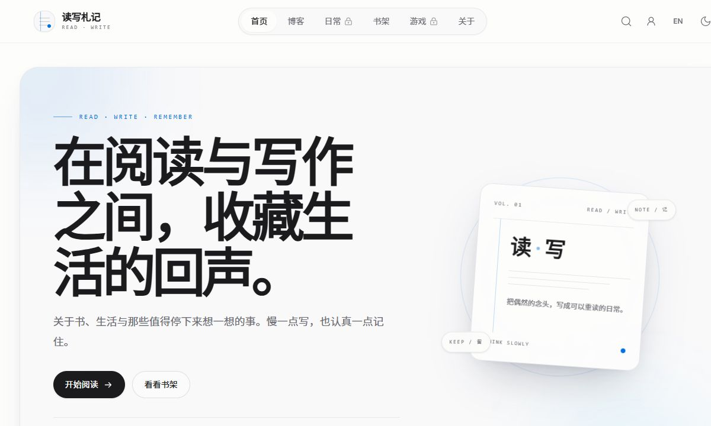
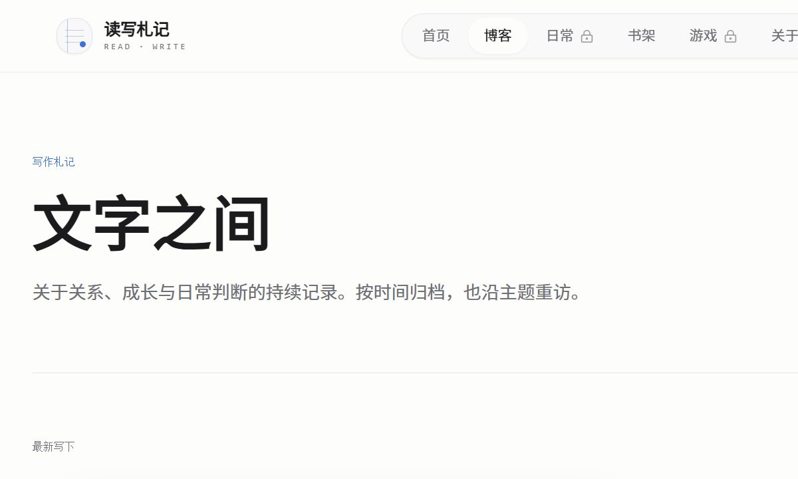
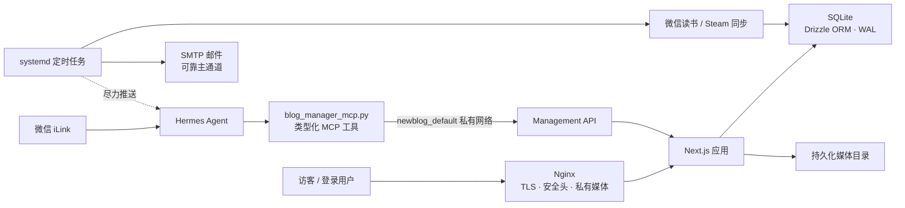

<div align="center">
  <h1>读写札记 · NewBlog</h1>
  <p><strong>一个把公开表达、阅读轨迹与私人思考放在同一处的个人出版系统。</strong></p>
  <p>
    不是内容管理后台的堆叠，而是一套为长期记录设计的、可自托管的个人空间。
  </p>
  <p>
    <a href="https://blog.kongyu204.com">在线实例</a> ·
    <a href="DEPLOYMENT.zh-CN.md">部署指南</a> ·
    <a href="docs/management-api.md">管理 API</a> ·
    <a href="docs/hermes-weixin-manual.zh-CN.md">Hermes 微信手册</a>
  </p>
  <p>
    <a href="https://github.com/yulv706/newblog/actions/workflows/ci.yml"></a>
    <a href="https://github.com/yulv706/newblog/releases"></a>
    <a href="LICENSE"></a>
    <a href="https://github.com/yulv706/newblog"></a>
  </p>
</div>

<p align="center">
  
</p>

## 项目定位

读写札记（NewBlog）是一个面向个人使用的全栈博客系统。它将“写下来”和“记住
生活”拆成不同的内容表面，同时又把文章、日常、书籍和游戏保存在同一套可维护的
数据与权限体系中。

它适合这样的使用方式：公开文章可以被读者阅读和评论；日常、书架和游戏档案只对
登录用户开放；目标、计划和不想公开的想法进入管理员专属的“私笺”；Hermes 则通过
微信成为一个自然语言入口，帮助所有者维护内容、同步数据和检查服务状态。

## 为什么值得使用

| 方向 | 设计重点 |
| --- | --- |
| 内容体验 | 留白、克制的排版和细腻的过渡动画，让文章阅读优先于后台操作感。 |
| 一个完整的个人档案 | 文章、日常、微信读书书架和 Steam 游戏库共享统一的账户与内容模型。 |
| 公开与私密并存 | 日常、游戏、书架需要登录；私笺只对管理员可见，且不会进入公开导航、搜索、RSS 或站点地图。 |
| 自然语言运维 | Hermes 通过受控 MCP 工具管理博客，不需要把服务器 Shell、Docker Socket 或数据库交给模型。 |
| 可靠的主动汇报 | SMTP 邮件是可靠主通道，微信 iLink 是有界的尽力通道；失败会记录、退避并进入系统状态页。 |
| 可恢复、可审计 | SQLite 快照、幂等键、并发更新时间保护、管理审计和健康检查共同降低误操作风险。 |
| 真正可自托管 | Docker Compose、Nginx、systemd 定时任务和持久化目录均在仓库中，可迁移到自己的服务器。 |

## 功能地图

| 模块 | 能做什么 | 默认可见范围 |
| --- | --- | --- |
| 首页 / 博客 | 精选文章、文章索引、分类标签、Markdown、封面、目录、RSS | 公开 |
| 日常 | 短记录、地点、话题、图片组、Markdown、时间线 | 登录用户 |
| 书架 | 微信读书同步、进度、阅读时长、书摘、感想、筛选与分页 | 登录用户 |
| 游戏 | Steam 游戏库、游玩时长、最近启动、封面、评分、短评与收藏 | 登录用户 |
| 账户 | 邮箱验证码登录、个人资料、评论关联 | 登录用户 |
| 后台 | 文章、日常、分类、评论、用户、书架、游戏、关于页、系统状态 | 管理员 |
| 私笺 | 想法、目标、计划、标签、进度、截止日期、归档与搜索 | 管理员本人 |
| Hermes | 内容维护、媒体上传、同步、备份、审计、私笺管理 | 私有 Docker 网络 + 管理令牌 |

## 界面预览

这是运行实例的实际界面截取，重点展示信息层级和内容阅读路径。个人数据库、上传
文件和运行时凭据不随仓库发布。

<table>
  <tr>
    <td width="50%"></td>
    <td width="50%" align="center" valign="middle">
      <strong>个人档案界面默认需要登录</strong><br>
      书架、游戏与私笺的真实数据不会随源码或截图发布。<br>
      部署后可在权限边界内启用这些模块。
    </td>
  </tr>
  <tr>
    <td align="center">文章索引：按时间、主题和阅读意图组织内容</td>
    <td align="center">公开预览与个人档案彼此隔离</td>
  </tr>
</table>

## 架构概览



### Hermes 的安全边界

Hermes 集成不是把一个高权限机器人直接放进服务器，而是将能力拆成三层：

1. **博客管理 API**：只暴露文章、日常、媒体、评论、用户、书籍、备份、审计和私笺等明确资源。
2. **MCP bridge**：对参数、分页、幂等键、并发更新时间和删除确认做类型化校验。
3. **部署边界**：管理 API 只监听博客容器的私有 Docker 网络；公开 Nginx 对该路径返回 `404`。

Hermes 可以有较高的内容操作自由度，但不会因此获得主机 Shell、Docker Socket、任意文件系统或
原始数据库访问权。管理员私笺还使用独立的 `BLOG_PRIVATE_NOTES_API_TOKEN`，不与通用管理令牌复用。

相关实现和操作手册：

- [`docs/management-api.md`](docs/management-api.md)
- [`integrations/hermes/blog_manager_mcp.py`](integrations/hermes/blog_manager_mcp.py)
- [`integrations/hermes/SKILL.md`](integrations/hermes/SKILL.md)
- [`docs/hermes-blog-manual.zh-CN.md`](docs/hermes-blog-manual.zh-CN.md)
- [`docs/hermes-weixin-manual.zh-CN.md`](docs/hermes-weixin-manual.zh-CN.md)

## 技术栈与目录

| 领域 | 选型 / 位置 |
| --- | --- |
| Web 应用 | Next.js App Router、React、TypeScript、Tailwind CSS、Motion |
| 数据层 | SQLite、Drizzle ORM、WAL、版本化迁移（`src/lib/db/`） |
| 部署 | Docker Compose、Nginx、systemd 定时任务（`deploy/`） |
| 自动化 | Hermes MCP bridge 与 Python 通知/同步任务（`integrations/`、`scripts/`） |
| 内容 | Markdown 文章、日常条目、书籍/游戏快照、持久化媒体（`public/uploads/`） |

源码主要位于 `src/`，数据库模型和迁移位于 `src/lib/db/`，部署入口位于 `deploy/`，
Hermes 适配和操作手册位于 `integrations/hermes/` 与 `docs/`。运行时数据、证书、上传文件
和本地运维资料由 `.gitignore` 明确排除。

## 安装与运行

### 方式一：本地开发

环境要求：Node.js 20+、npm 10+、Python 3.11+。数据库默认使用项目目录下的
`data/blog.db`，开发环境可以使用独立的临时目录。

```bash
git clone https://github.com/yulv706/newblog.git
cd newblog
npm ci
cp deploy/.env.production.example .env.local
cp deploy/.env.production.example deploy/.env.production
```

编辑 `.env.local`，至少设置一个随机的 `AUTH_SECRET` 和本地站点地址：

```bash
AUTH_SECRET="$(openssl rand -hex 32)"
NEXT_PUBLIC_SITE_URL=http://localhost:3000
```

然后启动：

```bash
npm run dev
```

本地邮箱测试可以启用 Mailpit：

```bash
docker compose --env-file deploy/.env.production --profile local-mail up -d mailpit
```

将开发环境的 SMTP 指向宿主机的 `127.0.0.1:1025` 后，在
[`http://localhost:8025`](http://localhost:8025) 查看验证码邮件。生产 SMTP 凭据不要用于本地调试。

### 方式二：Docker Compose 生产部署

生产部署需要 Docker Engine、Docker Compose plugin、`curl`、`python3` 和可用的 TLS 证书。完整的
单机部署说明见 [`DEPLOYMENT.zh-CN.md`](DEPLOYMENT.zh-CN.md)；下面是最短的标准流程：

```bash
git clone https://github.com/yulv706/newblog.git
cd newblog
cp deploy/.env.production.example deploy/.env.production

# 编辑 deploy/.env.production：至少填写 AUTH_SECRET、NEXT_PUBLIC_SITE_URL、端口和证书相关配置
# certs/blog.kongyu204.com.pem
# certs/blog.kongyu204.com.key

docker compose --env-file deploy/.env.production build app
./deploy/check.sh
./deploy/init.sh
./deploy/start.sh
```

`data/` 和 `public/uploads/` 是持久化数据，更新时不能删除。服务器资源较小时，建议在构建机生成
版本化镜像，再通过 `docker save` / `docker load` 传输到服务器；生产更新脚本不会在服务器重新编译
原生依赖。

### 首次创建管理员

新数据库没有默认用户名密码，也不会把第一个注册者静默设为管理员。首次部署前，在
`deploy/.env.production` 设置：

```dotenv
INITIAL_ADMIN_EMAIL=you@example.com
```

用这个邮箱完成一次验证码登录后即可进入 `/admin`。确认管理员入口正常后，删除该变量并重启应用：

```bash
sed -i '/^INITIAL_ADMIN_EMAIL=/d' deploy/.env.production
./deploy/update.sh
```

该变量只用于初始化引导；长期运行时应保持未配置。普通用户始终只能获得读者角色。

## 可选数据集成

| 集成 | 必要配置 | 手动同步 |
| --- | --- | --- |
| 微信读书 | `WEREAD_API_KEY=wrk-...` | `npm run sync:weread` |
| Steam | `STEAM_WEB_API_KEY`、`STEAM_ID64` | `npm run sync:steam` |
| Hermes | 两个管理令牌、私有 Docker 网络 | 通过微信自然语言调用 `blog_*` 工具 |
| 主动通知 | `SMTP_*`、`PROACTIVE_EMAIL_TO` | systemd 服务或状态页触发 |

同步任务只写入服务端快照，不把第三方密钥发送到浏览器。微信读书和 Steam 的网络失败会保留上一次
成功快照，并通过系统状态和可靠邮件通道报告，而不会清空已有数据。

## 日常运维

```bash
# 预检查
./deploy/check.sh

# 更新前创建可恢复快照
./deploy/backup.sh

# 拉取代码后更新，保留数据库与媒体
git pull --ff-only
./deploy/update.sh

# 查看服务和就绪探针
docker compose --env-file deploy/.env.production ps
curl -fsS "http://localhost:${NGINX_PORT}/healthz"
```

服务器定时任务位于 [`deploy/systemd/`](deploy/systemd/)：微信读书书架同步、Steam 同步、18:00 阅读
汇报、23:00 晚间推荐、新用户注册通知和服务健康检查均可独立启停。邮件是可靠主通道，微信 iLink
只做有界重试，不会因为微信账户级限流阻断主任务。

## 配置与安全原则

- 不提交 `.env*`、生产数据库、上传媒体、证书、私钥、管理令牌或第三方 API Key。
- 不把管理 API 通过公网反向代理暴露；Hermes 使用 `http://blog-app:3000` 的 Docker DNS 地址。
- 通用管理令牌和私笺令牌必须独立、随机且至少 32 个字符。
- 生产环境使用邮箱授权码和 TLS；不要把邮箱网页登录密码写入 SMTP 配置。
- 批量内容变更前创建快照；删除、权限变更和并发更新遵循 API 的确认与版本保护。
- 发现凭据进入日志、聊天或截图后，立即撤销并重新生成，而不是只修改 README。

更多安全说明见 [`SECURITY.md`](SECURITY.md)，贡献约定见 [`CONTRIBUTING.md`](CONTRIBUTING.md)。

## 文档索引

| 文档 | 内容 |
| --- | --- |
| [`DEPLOYMENT.zh-CN.md`](DEPLOYMENT.zh-CN.md) | Linux、Docker、Nginx、证书、备份、恢复和 systemd |
| [`DEPLOYMENT.md`](DEPLOYMENT.md) | English deployment guide |
| [`docs/management-api.md`](docs/management-api.md) | Hermes 管理 API、令牌、网络和通知任务 |
| [`docs/hermes-blog-manual.zh-CN.md`](docs/hermes-blog-manual.zh-CN.md) | 通过 Hermes 管理博客和私笺 |
| [`docs/hermes-weixin-manual.zh-CN.md`](docs/hermes-weixin-manual.zh-CN.md) | 微信端对话节奏和常用指令 |
| [`docs/versioning.md`](docs/versioning.md) | SemVer、镜像标签和发布流程 |

## 开发与发布

```bash
npm run version:check
npm run typecheck
npm test
python -m unittest discover -s scripts/tests -p 'test_*.py'
```

每次推送到 `main` 或创建 Pull Request 时，GitHub Actions 会在 Node.js 20 和 Ubuntu 环境执行同一组
检查。当前发布版本为 `v1.7.3`，遵循 [Semantic Versioning](https://semver.org/)；源码许可证为
[MIT License](LICENSE)。

<div align="center">
  <sub>Read a little. Write a little. Keep what is worth returning to.</sub>
</div>
